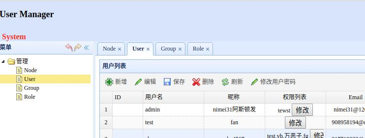

# 项目介绍
  通用用户/权限系统，支持用户注册，登录，校验，密码找回等;支持角色管理，组管理，用户权限分配;支持Session Cookie方式登录管理页面;支持JWT方式登录用户，提供了REST API;数据库支持Sqlite，Mysql，Postgres三种关系形数据库做持久化存储，JWT存储于redis数据中

## 使用方式
1. 执行 `go get -u github.com/bugfan/auth`
2. cd .../auth 
3. 执行 `go build`
4. 执行 `./auth` 
5. windows用户直接在命令行执行 `auth`
6. 在浏览器访问 `127.0.0.1:5000` 即可看到页面,默认帐号/密码:admin/admin

## JWT登录与退出
1. 服务对外暴露了3个JWT相关的REST API:login,logout 对应登录和退出
2. 发送post请求调用api `127.0.0.1:5000/login`，参数类型为json,`{"username":"xxx","password":"xxx"}`,返回`{"status":200,"data":"jwt string","msg":"msg data"}` 代表请求登录成功
3. 发送post请求调用api `127.0.0.1：5000/logout`,参数类型为json, `{"jwt":"jwt token string"}`,返回`{"status":200,"msg":"msg data"}` 代表退出请求成功,此会话不再有效

## docker部署
1. cd .../auth 
2. 执行 `docker build -t xxxx .` 构建镜像到自己机器
3. 执行 `docker-compose up -d` 首先会拉依赖的数据镜像 完成之后会自动启动
4. 在浏览器访问 `127.0.0.1:5000` 即可看到页面,默认帐号/密码:admin/admin 

## 效果
