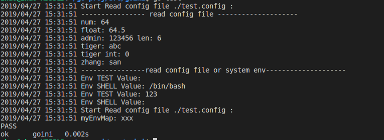

# 功能
  读取指定的配置文件(如果不指定配置文件将读取系统环境变量),并提供一些好用的接口来使用这些环境变量

# 使用方法
 go get github.com/bugfan/goini

## 读取单个或者多个配置文件到内存变量 (此方式支持读取多个配置文件,支持读取系统环境变量，并把所有读到的配置放到goini.Env对象，并返回)
1. goini.Env:=goini.NewEnv(".env") //读取配置文件到goini.Env (参数里面可以写一个也多个文件路径)
2. goini.Env:=goini.NewEnv()    //不指定配置文件路径则从系统读取环境变量(程序执行的进程空间中读取)
3. goini.Env.Getenv(key)  //获取key的vlaue 返回string类型
4. goini.Env.Getenvd(key,def) //获取不到则使用def作为值 返回string类型
5. goini.Env.GetAll()  //获取所有环境变量,返回一个map

## 读取指定的配置文件 (此方式每次从文件读取)
  ` 支持以[空格][等于号][冒号]分隔key与value `
1. goini.LoadConfig("./test.conf")
2. goini.Config.GetString("key")
3. goini.Config.GetInt("key")
3. goini.Config.GetFloat("key")

# 使用案例

` 可以参照 go test 文件来使用 `
` 配置文件支持以[空格][等于号][冒号]分隔key与value ，支持[#号]注释配置文件`  

``` 
  	log.Println("----------------read config file or system env--------------------")

	// read system env || config file

	// if args is nil it will read system env and return interface:MyEnv
	// save its to goini's Env
	// we can call it like NewEnv("./.env")
	Env = NewEnv()
	log.Println("Env TEST Value:", Env.Getenv("TEST")) //
	log.Println("Env SHELL Value:", Env.Getenv("SHELL"))
	// log.Println("All system env :", Env.GetAll())

	Env = NewEnv("./.env")
	log.Println("Env TEST Value:", Env.Getenv("TEST")) //
	log.Println("Env SHELL Value:", Env.Getenv("SHELL"))
	// log.Println("All system env :", Env.GetAll())

	log.Println("Start Read config file ./test.config :")
	myEnvMap, err := ReadFile(".env") // return a map & error
	if err != nil {
		log.Fatal(err)
	}
	log.Println("myEnvMap:", myEnvMap["ZHAO"])
```
  执行结果如下:  
  
  


